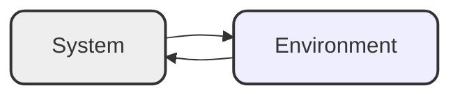

An **intelligent agent** is a system that perceives its environment and takes actions that maximize its chances of successfully achieving its goals. Agents are used to build a wide variety of applications, including web search engines, recommender systems, smart home devices, and autonomous vehicles. The agent paradigm is also used to study human decision-making and to build artificial intelligence systems that interact with humans.

<!--more-->

## Table of Contents

- [Definition and Properties](#definition-and-properties)
  - [Reactivity](#reactivity)
  - [Proactiveness](#proactiveness)
  - [Social Ability](#social-ability)
  - [Other Properties](#other-properties)
- [Agents and Related Concepts](#agents-and-related-concepts)
  - [Agents and Objects](#agents-and-objects)
  - [Agents and Artificial Intelligence](#agents-and-artificial-intelligence)
  - [Agents and Expert Systems](#agents-and-expert-systems)
  - [Agents as Intensional Systems](#agents-as-intensional-systems)
- [Environment and its classification](#environment-and-its-classification)
  - [Accessibility and Inaccessibility](#accessibility-and-inaccessibility)
  - [Deterministic and Non-Deterministic](#deterministic-and-non-deterministic)
  - [Episodic and Non-Episodic](#episodic-and-non-episodic)
  - [Static and Dynamic](#static-and-dynamic)
  - [Discrete and Continuous](#discrete-and-continuous)
- [Abstract Architecture for Agents](#abstract-architecture-for-agents)

---

# Definition and Properties

An agent is a computer system capable of **autonomous** action in some environment in order to meet its design objectives.

$$
\text{autonomous} \begin{cases}
    \text{capable of acting independently} \\
    \text{control over internal state}
\end{cases}
$$

An **intelligent** agent is a computer system capable of **flexible** autonomous action in some environment in order to meet its design objectives.

$$
\text{flexible} \begin{cases}
    \text{reactive}\\
    \text{pro-active}\\
    \text{social}
\end{cases}
$$

## Reactivity
If the environment is fixed, a program can simply follow its instructions without worrying about success or failure (like a compiler). However, in dynamic environments, a program must take into account the possible changes in the environment and be able to handle changes. A reactive system is one that maintains an **ongoing interaction with its environment** and **responds to changes in a timely manner**.

## Proactiveness
Proactive behavior involves **goal-directed** activity, where an agent takes the **initiative** to achieve its objectives rather than simply **reacting** to events. This capability is essential for autonomous systems, as it enables them to **recognize** opportunities and take advantage of them to achieve their goals.

A key challenge in designing autonomous systems is **balancing** the need for **reactivity** against the need for **proactiveness**. On the one hand, we want our agents to be reactive, responding to changing conditions in an appropriate (timely) fashion. On the other hand, we want our agents to systematically work towards long-term goals. These two considerations can be at odds with one another. Designing an agent that can balance the two remains an **open research problem**.

## Social Ability
In real-world multi-agent environments, goals cannot be achieved unilaterally without consideration for other agents. In many cases, **cooperation** with other agents is a necessary condition for achieving goals. This is also true for many computing environments, such as the Internet. Social ability in agents enables them to interact with other agents (and potentially humans) using an **agent-communication language**, and to collaborate with others when necessary.

## Other Properties
<table>
  <thead>
    <tr>
      <th>Property</th>
      <th>Description</th>
    </tr>
  </thead>
  <tbody>
    <tr>
      <td>Mobility</td>
      <td>The ability of an agent to move around an electronic network.</td>
    </tr>
    <tr>
      <td>Veracity</td>
      <td>An agent will not knowingly communicate false information.</td>
    </tr>
    <tr>
      <td>Benevolence</td>
      <td>Agents do not have conflicting goals, and every agent will therefore always try to do what is asked of it.</td>
    </tr>
    <tr>
      <td>Rationality</td>
      <td>An agent will act in order to achieve its goals, and will not act in such a way as to prevent its goals from being achieved, as far as its beliefs permit.</td>
    </tr>
    <tr>
      <td>Learning/Adaptation</td>
      <td>Agents improve performance over time.</td>
    </tr>
  </tbody>
</table>

# Agents and Related Concepts

## Agents and Objects

## Agents and Artificial Intelligence

## Agents and Expert Systems

## Agents as Intensional Systems

# Environment and its classification

## Accessibility and Inaccessibility

An **accessible** environment is one in which the agent can obtain **complete**, **accurate**, **up-to-date** information about the environment's state. Most moderately complex environments (including, for example, the everyday physical world and the Internet) are **inaccessible**. The more accessible an environment is, the simpler it is to build agents to operate in it.

## Deterministic and Non-Deterministic

A **deterministic** environment is characterized by actions that consistently lead to a **single, predictable** outcome without any ambiguity regarding the resulting state. In contrast, the physical world, for all practical reasons, can be considered **non-deterministic**. Such **non-deterministic** environments pose significant challenges for those designing agents, as they must account for **uncertainty** and **variability** in outcomes.

## Episodic and Non-Episodic

In an **episodic environment**, the performance of an agent is dependent on a number of discrete episodes, with no link between the performance of an agent in different scenarios. **Episodic environments are simpler from the agent developer’s perspective** because the agent can decide what action to perform based only on the current episode — it need not reason about the interactions between this and future episodes.

## Static and Dynamic

A **static** environment is one that can be assumed to remain unchanged except by the performance of actions by the agent. In contrast, a **dynamic** environment is one that has other processes operating on it, and which hence changes in ways beyond the agent’s control. In such environments, other processes can **interfere** with the agent’s actions (as in concurrent systems theory). For example, the physical world is a highly dynamic environment.

## Discrete and Continuous

An environment is **discrete** if there are a **fixed**, **finite** number of actions and percepts in it. Russell and Norvig give a chess game as an example of a discrete environment, and taxi driving as an example of a continuous one. Continuous environments have a certain level of mismatch with computer systems. Discrete environments could in principle be handled by a kind of "lookup table".

# Abstract Architecture for Agents

Assume the **environment** may be in any of a finite set $E$ of discrete, instantaneous **states**:
$$
    E = \{e_1, e_2, \ldots, e_n\}
$$

Agents are assumed to have a repertoire of possible **actions** available to them, which **transform** the state of the environment:
$$
    Ac = \{\alpha_1, \alpha_2, \ldots, \alpha_{n-1}\}
$$

A **run**, $r$, of an agent in an environment is a **sequence** of interleaved environment **states** and **actions**:
$$
    r = (e_1, \alpha_1, e_2, \alpha_2, \ldots) \in E \times (Ac \times E)^* \text{ or } (E \times Ac)^*
$$

$R$ is denoted as set of the all such **possible** finite **sequences** over $E$ and $Ac$
$$
    R = \{r, r', \ldots\}
$$

$R^{Ac}$ is the subset of $R$ that **end** with an **action**.
$$
    R^{Ac} = \{\forall r \in (E \times Ac)^*\}
$$

$R^{E}$ is the subset of $R$ that **end** with an **environment state**.
$$
    R^{E} = \{\forall r \in E \times (Ac \times E)^*\}
$$

A **state transformer function** represents **behavior** of the **environment**.
$$
    \tau : R^{Ac} \to \phi(E)
$$